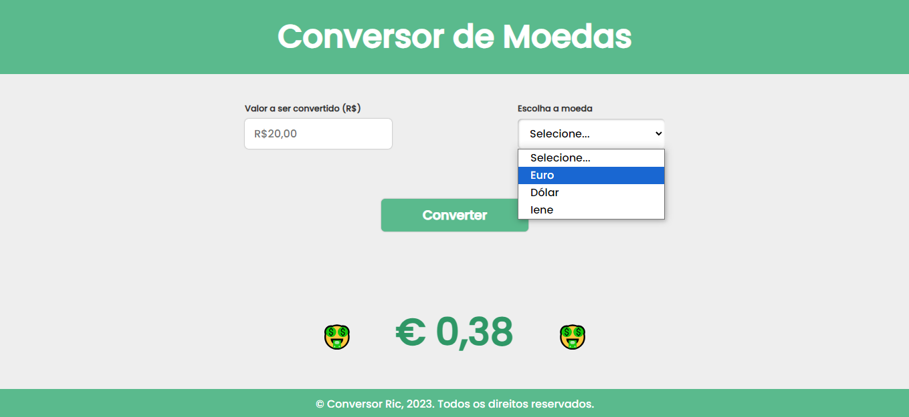
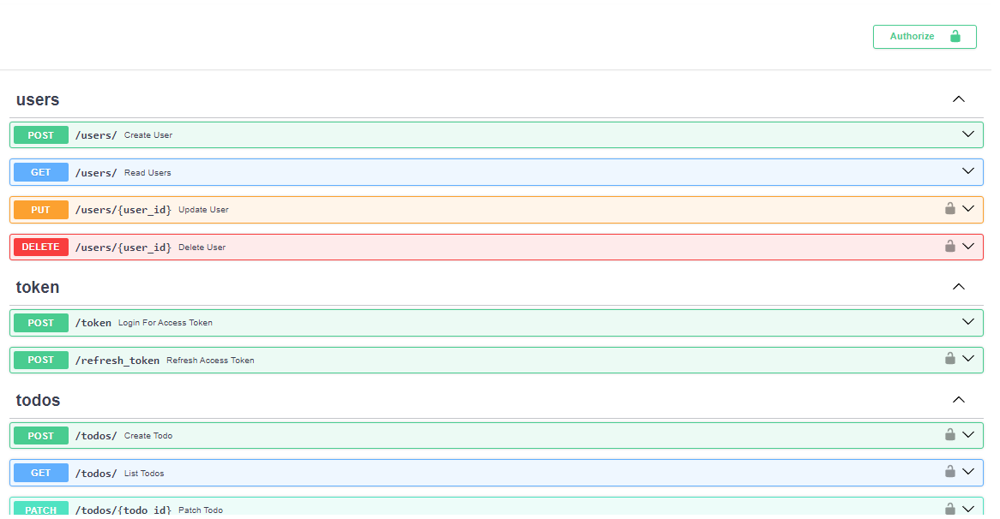
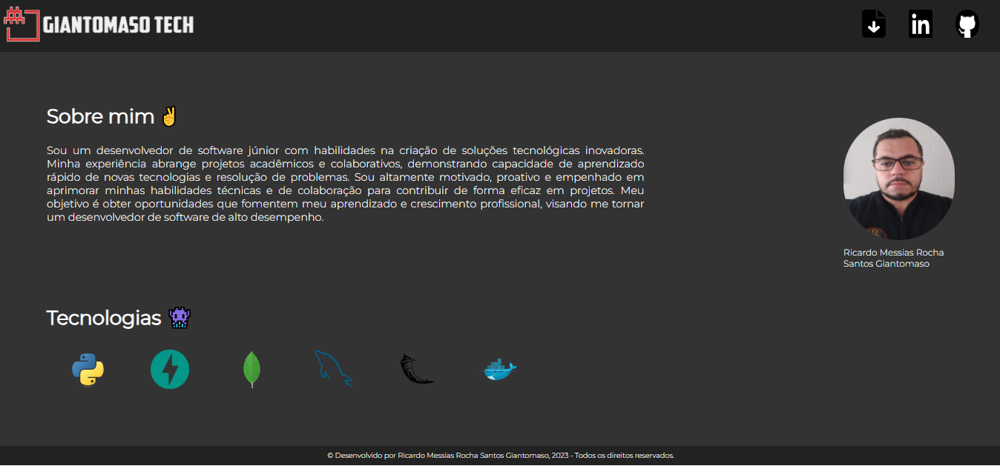

# Meus Projetos
Aqui estão listados apenas alguns dos meus projetos, para conferir mais, acesse meu repositório do [Github](https://github.com/ricgiantomaso/)!

 
## Conversor de moedas em JavaScript

**Descrição do projeto:**

Um conversor de moedas feito com Java Script, HTML e CSS. Esse aplicativo converte o valor inserido em Real e retorna uma saída em Euro, Iene ou em Dólar. Foi estruturado com HTML puro e estilizado com CSS sem utilização de qualquer framework.

Tecnologias usadas

[Link do Projeto no Github](https://github.com/ricgiantomaso/Coin_Converter)

## API com CRUD, autenticação JWT e Bearer token

**Descrição do projeto:**

Este projeto foi desenvolvido baseado no curso "FastAPI do Zero" ministrado pelo @Dunossauro. A aplicação a seguir é uma API com um CRUD completo com autenticação e testes integrados. A aplicação também foi conteinerizada com Docker, o que a torna robusta e escalável em qualquer ambiente. O projeto ainda está incompleto, faltando ajustar a pipeline de CI e incrementar testes unitários. Segue imagem de todas as rotas criadas na aplicação.

Tecnologias usadas

[Link do Projeto no Github](https://github.com/ricgiantomaso/fast_zero)

## Landing Page de apresentação

**Descrição do projeto:**

Landing page desenvolvida em HTML para apresentação pessoal. A página que foi estruturada em HTML e estilizada com CSS, possui um design responsivo e intuitivo. Apesar de ser um projeto simples, as tecnologias utilizadas foram implementadas de forma inteligente. 

Tecnologias usadas

[Link do Projeto no Github](https://github.com/ricgiantomaso/portfolio_page).